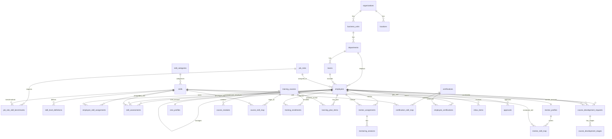

# PTE CIP High-Level ERD

```mermaid
erDiagram
  organizations ||--o{ business_units : has
  organizations ||--o{ locations : has
  business_units ||--o{ departments : has
  departments ||--o{ teams : has
  departments ||--o{ employees : employs
  teams ||--o{ employees : includes
  job_roles ||--o{ employees : assigned_to
  employees ||--o{ employees : manages

  job_roles ||--o{ job_role_skill_benchmarks : requires
  skills ||--o{ job_role_skill_benchmarks : benchmarked
  skill_categories ||--o{ skills : categorizes
  skills ||--o{ skill_level_definitions : defines
  skills ||--o{ employee_skill_assignments : assigned
  employees ||--o{ employee_skill_assignments : owns

  employees ||--o{ skill_assessments : assessed_employee
  employees ||--o{ skill_assessments : assessor
  skills ||--o{ skill_assessments : rated_skill

  employees ||--|| mentor_profiles : mentor_account
  employees ||--|| sme_profiles : sme_account
  mentor_profiles ||--o{ mentor_skill_map : covers
  skills ||--o{ mentor_skill_map : mentored_skill
  employees ||--o{ mentor_assignments : mentor
  employees ||--o{ mentor_assignments : mentee
  mentor_assignments ||--o{ mentoring_sessions : has

  training_courses ||--o{ course_modules : contains
  training_courses ||--o{ course_skill_map : maps_to
  skills ||--o{ course_skill_map : developed_by
  training_courses ||--o{ training_enrollments : enrolled
  employees ||--o{ training_enrollments : learner
  employees ||--o{ learning_plan_items : has_plan
  training_courses ||--o{ learning_plan_items : planned_course

  course_development_requests ||--o{ course_development_stages : has_stages
  skills ||--o{ course_development_requests : gap_skill
  employees ||--o{ course_development_requests : sme
  employees ||--o{ course_development_requests : coordinator

  certifications ||--o{ certification_skill_map : validates
  skills ||--o{ certification_skill_map : skill
  employees ||--o{ employee_certifications : earns
  certifications ||--o{ employee_certifications : certificate

  employees ||--o{ inbox_items : receives
  employees ||--o{ approvals : approves
```
